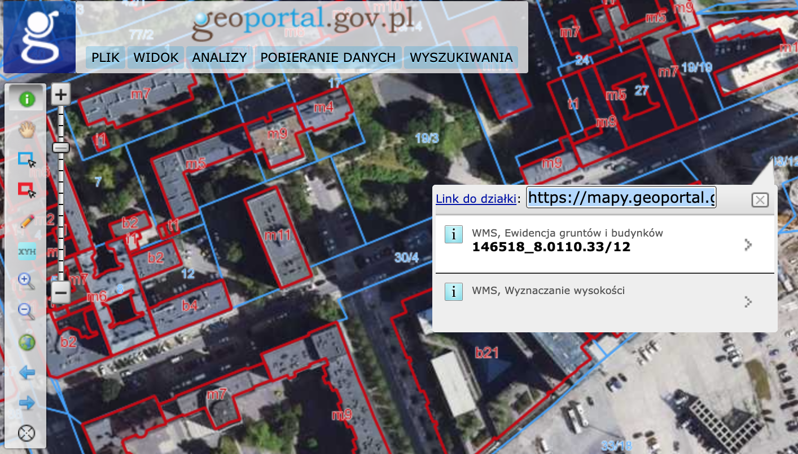

# GeoportalShareParcel

Script which shows copyable link to selected parcel in header of table with parcel info.

## Install

Get [Tampermonkey](https://www.tampermonkey.net/) and then click [here](https://raw.githubusercontent.com/piotrgredowski/geoportal-share-parcel/main/geoportal-share-parcel.user.js) to install.

## Screenshot

